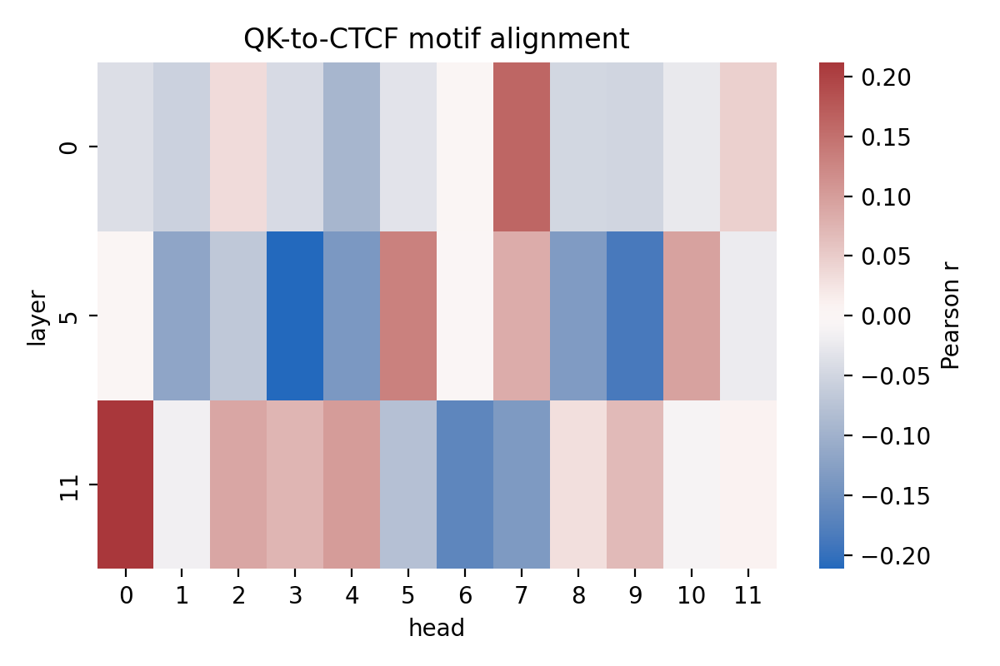
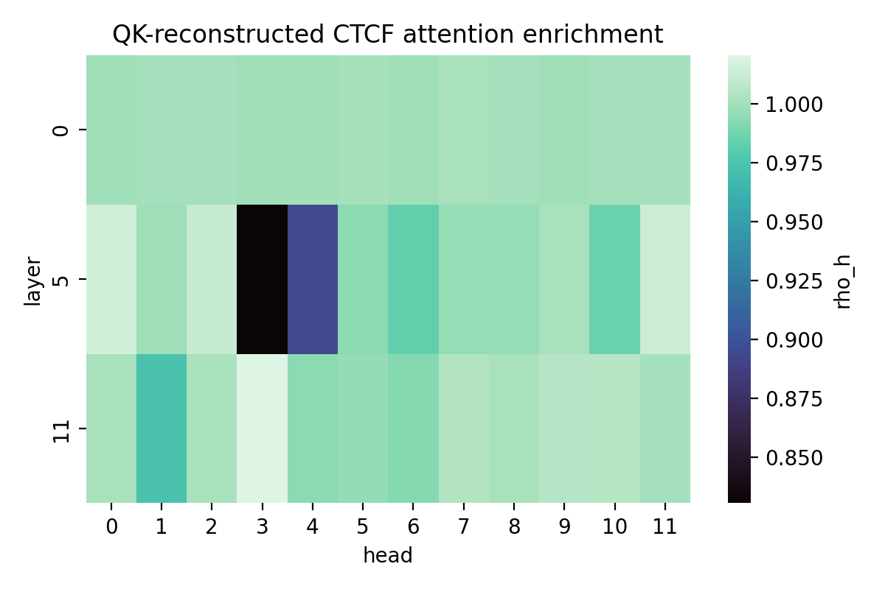
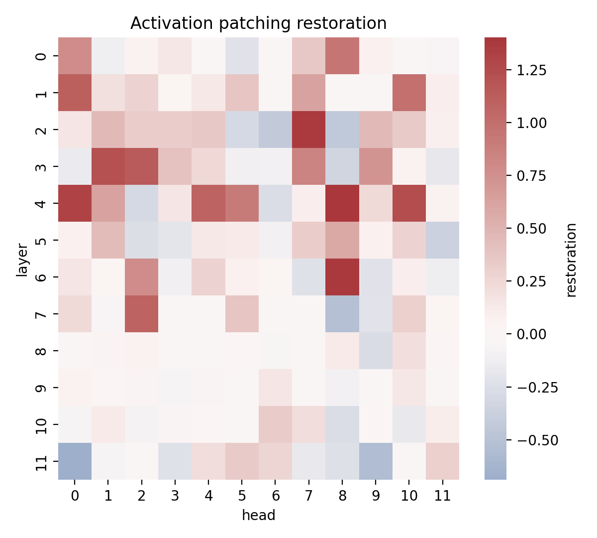
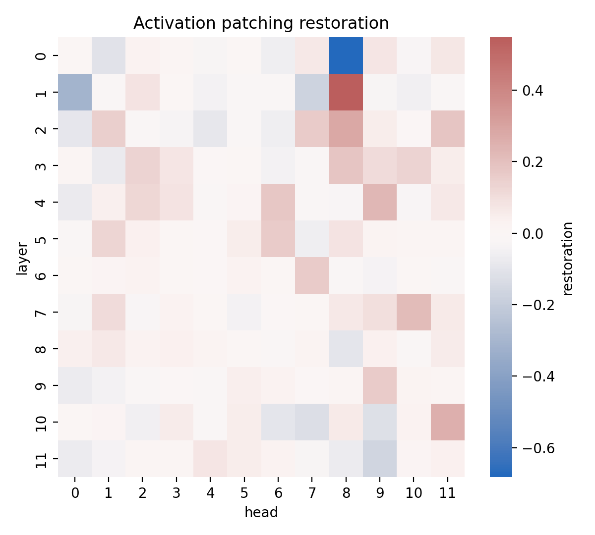
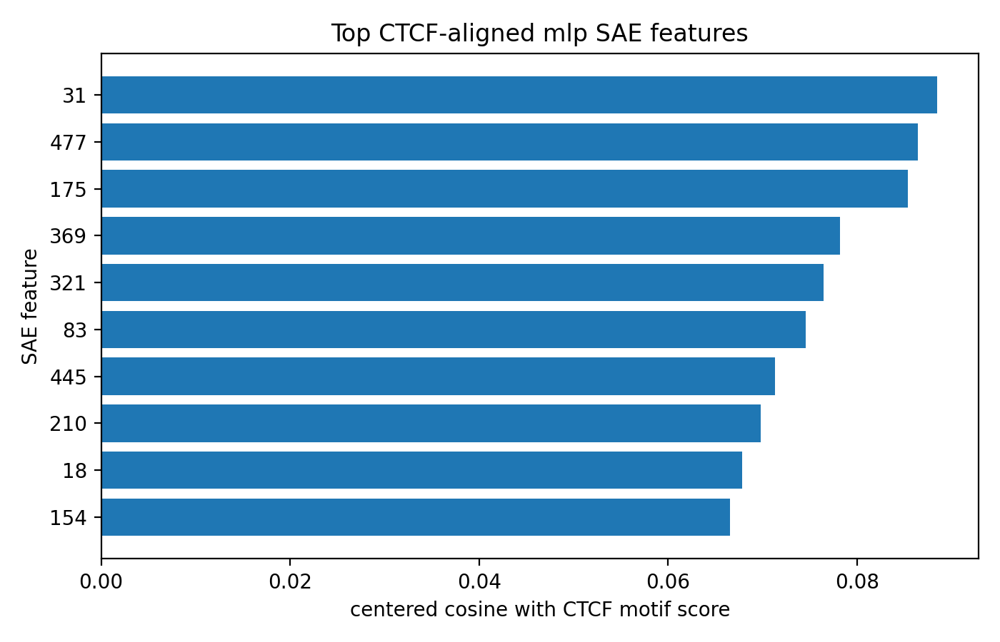

# MINTS

**Mechanistic Interpretability for Nucleotide Transformer Sequences**

**TL;DR:** MINTS is a reproducible mechanistic-interpretability pipeline for genomic transformers. It loads DNABERT-2 and Nucleotide Transformer backends, extracts QK/OV circuit matrices, probes frozen residual streams, scores CTCF motif support from JASPAR, tests QK-to-motif alignment and matched attention enrichment, runs custom DNABERT forward-hook activation patching, and searches for distributed CTCF-aligned SAE features.

MINTS asks a narrow question: can we move from "this genomic transformer predicts biological labels" to "this specific circuit component implements a biological motif detector"? The current answer is useful but disciplined: DNABERT-2 strongly encodes promoter and splice-site labels in its layer-11 residual stream, but the completed strict CTCF scan does **not** prove a single CTCF motif-detector attention head.

The research paper lives in [`paper/main.pdf`](paper/main.pdf), with source in [`paper/main.tex`](paper/main.tex).

## Key Achievements

- **One-command reproducibility:** `python main.py` runs data checks, model loading, residual probing, QK/OV export, strict CTCF scans, systematic patching, SAE feature search, cross-model comparison, and writes [`results/pipeline_run.json`](results/pipeline_run.json).
- **Strong residual decodability:** DNABERT-2 layer-11 probes reach AUROC `0.9137`, `0.9383`, `0.8954`, and `0.8847` on promoter/splice tasks, with bootstrap confidence intervals in [`results/tables/linear_probe_metrics.csv`](results/tables/linear_probe_metrics.csv).
- **Negative strict CTCF proof:** Across the full `51,249` GM12878 CTCF sequence scan, no tested DNABERT-2 head passed the registered CTCF QK criterion `r >= 0.5, p < 0.05`, and no head passed matched attention enrichment `rho_h >= 2.0`.
- **Causal patching signal:** Batch DNABERT forward-hook patching found strong promoter-TATA restoration, with best mean restoration `PM = 1.4216` at layer `2`, head `7` over `327` pairs. Splice-donor patching found a weaker but threshold-crossing best head, layer `1`, head `8`, with `PM = 0.5285` over `500` pairs.
- **Cross-model tokenization comparison:** On the same residual-probe benchmark, DNABERT-2 BPE strongly outperformed Nucleotide Transformer fixed 6-mer tokenization in this pipeline, with AUROC deltas from `+0.2408` to `+0.3259` in favor of DNABERT-2.
- **Distributed feature search:** SAE feature search ran over `2,048` CTCF sequences and produced residual/MLP feature rankings, but the top CTCF motif cosine was only `0.0884`; this is weak alignment, not a discovered monosemantic CTCF feature.

## Overview

### What it does

MINTS prepares nucleotide benchmark data, loads genomic transformer backends, exports model internals, trains residual-stream probes, creates motif-destroying counterfactuals, runs activation patching, and writes a compact artifact bundle under [`results/`](results). The pipeline treats attention heads as hypotheses: a head is not called a motif detector unless QK alignment, motif-local enrichment, and causal restoration agree.

### Why it matters

Genomic transformer predictions alone do not prove biological mechanisms. A high AUROC can come from distributed representations, tokenization artifacts, or dataset shortcuts. MINTS forces a stronger evidence stack: residual decodability, circuit matrix extraction, ground-truth motif scoring, matched-background enrichment, and denoising causal interventions.

### What is novel here

The novel contribution is the combination of computational biology ground truth with mechanistic circuit tests on a reproducible local pipeline. The current run shows why this matters: the representation-level story is positive, but the strict single-head CTCF motif-detector story fails. That negative result is scientifically useful because it prevents an overclaim.

### How it works

1. The pipeline reads [`src/config.py`](src/config.py) and creates `data/` and `results/` directories.
2. Hugging Face downstream tasks are filtered and tokenized into `data/hf_downstream/`.
3. ENCODE GM12878 CTCF artifacts and GRCh38 sequence tables are prepared under `data/`.
4. DNABERT-2 is loaded on CUDA when available through Hugging Face forward hooks after TransformerLens compatibility fallback.
5. Residual vectors are cached for layers `0`, `5`, and `11`; QK/OV matrices are exported for the same layers.
6. Logistic probes are trained on frozen layer-11 residual vectors.
7. JASPAR `MA0139.1` CTCF motif scores are aligned to model token positions across GM12878 CTCF sequences.
8. QK-to-motif Pearson correlations and matched motif/background enrichment ratios are computed.
9. Clean/corrupted motif pairs are generated for activation patching.
10. Batch denoising patching runs across all `12 x 12` DNABERT-2 layer/head positions.
11. Sparse autoencoders are trained on CTCF residual/MLP activation exports for distributed-feature search.
12. DNABERT-2 is compared with `InstaDeepAI/nucleotide-transformer-v2-100m-multi-species` using the same probe and CTCF enrichment workflow.

## Latest Full Run

The latest full run started at `2026-04-13 21:00:22` and ended at `2026-04-14 00:04:34` local time (`Asia/Calcutta`). The root manifest timestamp is `2026-04-13T18:34:34+00:00`. The manifest reports `11,051.958` seconds, or `3.070` hours, across all pipeline steps.

Runtime breakdown:

- `write_config`: `0.001s`
- `ingest_hf_downstream`: `17.821s`
- `download_encode_ctcf`: `0.250s`
- `download_grch38`: `2.895s`
- `prepare_ctcf_sequences`: `1.103s`
- `circuit_extraction_and_residual_probing`: `497.519s`
- `strict_mechanistic_proofs`: `2857.587s`
- `systematic_causal_intervention`: `1863.729s`
- `distributed_feature_search`: `39.111s`
- `cross_model_tokenization_comparison`: `5771.942s`

The `results/` tree now contains `120` files in the local artifact inventory, including `56` JSON summaries/manifests, `20` CSV tables, `3` TSV counterfactual-pair tables, `11` PNG figures, `28` NPZ activation/circuit archives, and `2` SAE checkpoint files. The large reproducible NPZ/PT/token-motif artifacts are intentionally ignored by Git; after the ignore rules are applied, the largest still-untracked review artifact is about `0.62 MB`.

## Main Results

### DNABERT-2 Residual Probes

Layer-11 residual vectors are strongly predictive for all four configured biological tasks:

| Task | Train / Test | AUROC | 95% CI | AUPRC | 95% CI | Accuracy |
|---|---:|---:|---:|---:|---:|---:|
| `promoter_tata` | `5062 / 212` | `0.9137` | `0.8751-0.9475` | `0.9241` | `0.8874-0.9557` | `0.8349` |
| `promoter_no_tata` | `30000 / 1372` | `0.9383` | `0.9253-0.9499` | `0.9475` | `0.9364-0.9577` | `0.8550` |
| `splice_sites_donors` | `30000 / 3000` | `0.8954` | `0.8839-0.9060` | `0.9049` | `0.8895-0.9191` | `0.8230` |
| `splice_sites_acceptors` | `30000 / 3000` | `0.8847` | `0.8723-0.8959` | `0.8954` | `0.8802-0.9085` | `0.8090` |

Interpretation: the biological labels are linearly decodable from frozen DNABERT-2 residual states. This supports representation-level biological encoding, but not a localized motif-detector proof.

### Strict CTCF QK and Enrichment

The strict CTCF scan used all `51,249` prepared GM12878 CTCF sequences.

- DNABERT-2 QK scan: `36` heads from layers `0`, `5`, and `11`
- Best DNABERT-2 QK-to-motif correlation: layer `11`, head `0`, `r = 0.2119`, `n = 1,843,874`, `p ~= 0`
- Passing DNABERT-2 QK candidates: `0`
- Best DNABERT-2 matched enrichment: layer `11`, head `3`, `rho_h = 1.0209`
- Passing DNABERT-2 enrichment candidates: `0`
- Motif-support/background tokens in DNABERT-2 enrichment: `256,918 / 256,918`

Interpretation: the QK correlations are statistically nonzero because the scan is very large, but the effect sizes are far below the registered `r >= 0.5` criterion. The enrichment ratios are close to background. The run does not prove a strict CTCF motif-detector head.





### Activation Patching

Single-pair promoter-TATA patching found a partial causal signal:

- Pair: `chr20:257674-257974|1`
- Mutation: `TATAAA` at `[20, 26)` to `GCGCGC`
- Best head: layer `7`, head `8`
- Restoration: `PM = 0.5983`
- Mean restoration across finite heads: `0.00463`

Batch denoising patching is more important for the current run:

| Task | Pairs | Best layer/head | Best PM | Mean PM | Denominator failures |
|---|---:|---:|---:|---:|---:|
| `promoter_tata` | `327` | layer `2`, head `7` | `1.4216` | `0.1434` | `0` |
| `splice_sites_donors` | `500` | layer `1`, head `8` | `0.5285` | `0.0076` | `0` |

Interpretation: promoter-TATA has a strong causal restoration signal under batch patching, including over-restoration above `1.0`. Splice donor has a weaker but threshold-crossing best head. These are task-specific causal signals; they do not rescue the failed CTCF strict motif-detector claim.





### Distributed SAE Feature Search

The distributed feature search trained sparse autoencoders on `2,048` CTCF sequences:

- Residual activation shape: `2048 x 768`
- MLP activation shape: `2048 x 768`
- Dictionary size: `512`
- Epochs: `10`
- Best CTCF motif cosine: `0.0884`
- Top feature: `31`
- Top activation frequency: `0.5049`

Important caveat: the saved residual and MLP activation arrays are numerically identical in this run (`max abs diff = 0.0`). That means the SAE result should be interpreted as a preliminary distributed-feature search on the captured layer-11 activation stream, not as evidence that a distinct MLP subspace was isolated.

Interpretation: no strong monosemantic CTCF SAE feature was found. The weak top cosine is consistent with the broader result that CTCF information is not isolated in a simple attention-head detector in this configuration.




### Cross-Model Tokenization Comparison

The cross-model comparison evaluated:

- DNABERT-2: `zhihan1996/DNABERT-2-117M`, tokenization family `BPE`, hidden width `768`, `12` heads in tested layers
- Nucleotide Transformer: `InstaDeepAI/nucleotide-transformer-v2-100m-multi-species`, tokenization family `fixed_6mer`, hidden width `512`, `16` heads in tested layers

Probe comparison:

| Task | DNABERT-2 AUROC | NT AUROC | DNABERT-2 delta | DNABERT-2 AUPRC | NT AUPRC | DNABERT-2 delta |
|---|---:|---:|---:|---:|---:|---:|
| `promoter_tata` | `0.9137` | `0.6502` | `+0.2634` | `0.9241` | `0.6703` | `+0.2538` |
| `promoter_no_tata` | `0.9383` | `0.6976` | `+0.2408` | `0.9475` | `0.6996` | `+0.2479` |
| `splice_sites_donors` | `0.8954` | `0.5695` | `+0.3259` | `0.9049` | `0.5577` | `+0.3472` |
| `splice_sites_acceptors` | `0.8847` | `0.5647` | `+0.3200` | `0.8954` | `0.5496` | `+0.3457` |

CTCF strict-scan comparison:

- DNABERT-2 best QK correlation: `r = 0.2119`
- Nucleotide Transformer best QK correlation: `r = 0.0192`
- DNABERT-2 best enrichment: `rho_h = 1.0209`
- Nucleotide Transformer best enrichment: `rho_h = 1.00005`
- Passing QK/enrichment candidates for either model: `0`

Interpretation: in this exact benchmark, DNABERT-2 BPE is much more linearly probeable than the Nucleotide Transformer fixed-6mer backend. However, neither model yields a strict CTCF motif-detector head under the registered thresholds.

## Running

Create an environment and install dependencies:

```bash
python -m venv .venv
.\.venv\Scripts\Activate.ps1
python -m pip install -r requirements.txt
```

Run the full repository pipeline:

```bash
python main.py
```

Run a capped debug pass:

```bash
python main.py --max-probe-train 512 --max-probe-test 256 --max-qk-alignment-sequences 128 --max-cross-model-qk-alignment-sequences 128 --max-feature-search-sequences 128 --sae-epochs 1
```

Useful flags:

- `--overwrite`: rebuild generated datasets and redownload artifacts when needed
- `--max-probe-train`: cap train examples per task for activation caching and probing
- `--max-probe-test`: cap test examples per task for activation caching and probing
- `--max-qk-alignment-sequences`: cap CTCF sequences for strict QK motif-alignment exports
- `--max-patching-pairs`: cap systematic denoising activation-patching pairs per task
- `--max-feature-search-sequences`: cap CTCF sequences for residual/MLP SAE feature search
- `--sae-epochs`: control SAE training epochs
- `--max-cross-model-qk-alignment-sequences`: cap CTCF sequences for cross-model QK/enrichment comparison
- `--probe-bootstrap-samples`: bootstrap resamples for probe confidence intervals
- `--probe-ci-level`: probe confidence interval level
- `--from-step`: start from a named checkpoint and continue forward
- `--json`: print a machine-readable completion payload

Resume from a later checkpoint:

```bash
python main.py --from-step systematic_causal_intervention
python main.py --from-step distributed_feature_search
python main.py --from-step cross_model_tokenization_comparison
```

## Data

The pipeline expects the ENCODE URL list in [`data/`](data):

- `ENCODE4_v1.5.1_GRCh38.txt`

The configured ENCODE URL file should include direct downloads for:

- `ENCFF680XUD.bigWig`
- `ENCFF827JRI.bed.gz`
- `ENCFF511URZ.bigBed`

The Hugging Face downstream data is downloaded programmatically and saved under:

- `data/hf_downstream/promoter_tata`
- `data/hf_downstream/promoter_no_tata`
- `data/hf_downstream/splice_sites_donors`
- `data/hf_downstream/splice_sites_acceptors`

CTCF-derived sequence tables are written under:

- `data/ctcf/`

## Outputs

Primary outputs:

- [`results/pipeline_run.json`](results/pipeline_run.json)
- [`results/tables/linear_probe_metrics.csv`](results/tables/linear_probe_metrics.csv)
- [`results/tables/cross_model_tokenization_comparison.json`](results/tables/cross_model_tokenization_comparison.json)
- [`results/qk_alignment/ctcf_qk_alignment.csv`](results/qk_alignment/ctcf_qk_alignment.csv)
- [`results/enrichment/ctcf_qk_alignment_matched_attention_enrichment.csv`](results/enrichment/ctcf_qk_alignment_matched_attention_enrichment.csv)
- [`results/patching/promoter_tata_batch_dnabert_activation_patching.csv`](results/patching/promoter_tata_batch_dnabert_activation_patching.csv)
- [`results/patching/splice_sites_donors_batch_dnabert_activation_patching.csv`](results/patching/splice_sites_donors_batch_dnabert_activation_patching.csv)
- [`results/distributed_features/ctcf_sae_feature_alignment_top10.csv`](results/distributed_features/ctcf_sae_feature_alignment_top10.csv)

Important figures:

- [`results/figures/ctcf_qk_alignment_pearson_heatmap.png`](results/figures/ctcf_qk_alignment_pearson_heatmap.png)
- [`results/figures/ctcf_qk_alignment_matched_attention_enrichment_rho_heatmap.png`](results/figures/ctcf_qk_alignment_matched_attention_enrichment_rho_heatmap.png)
- [`results/figures/promoter_tata_dnabert_activation_patching_heatmap.png`](results/figures/promoter_tata_dnabert_activation_patching_heatmap.png)
- [`results/figures/promoter_tata_batch_dnabert_activation_patching_heatmap.png`](results/figures/promoter_tata_batch_dnabert_activation_patching_heatmap.png)
- [`results/figures/splice_sites_donors_batch_dnabert_activation_patching_heatmap.png`](results/figures/splice_sites_donors_batch_dnabert_activation_patching_heatmap.png)
- [`results/figures/ctcf_residual_sae_top10_alignment.png`](results/figures/ctcf_residual_sae_top10_alignment.png)
- [`results/figures/ctcf_mlp_sae_top10_alignment.png`](results/figures/ctcf_mlp_sae_top10_alignment.png)

Large generated artifacts are intentionally ignored by Git and removed from the repository commit surface. They are reproducible outputs, not source files. The largest classes are activation caches, QK/OV matrix archives, SAE checkpoints/activation archives, and token-level motif-score dumps.

Do not commit these generated artifact classes:

- `results/**/activations/*.npz`
- `results/**/circuits/*.npz`
- `results/distributed_features/*.npz`
- `results/**/*.pt`
- `results/**/enrichment/*token_motif_scores.csv`

Examples from the latest run:

- `results/enrichment/ctcf_qk_alignment_token_motif_scores.csv` (`111.85 MB`)
- `results/cross_model/zhihan1996__dnabert_2_117m/enrichment/zhihan1996__dnabert_2_117m_ctcf_qk_alignment_token_motif_scores.csv` (`111.85 MB`)
- `results/cross_model/instadeepai__nucleotide_transformer_v2_100m_multi_species/enrichment/instadeepai__nucleotide_transformer_v2_100m_multi_species_ctcf_qk_alignment_token_motif_scores.csv` (`92.08 MB`)
- `results/cross_model/zhihan1996__dnabert_2_117m/activations/splice_sites_donors_train_residual_mean.npz` (`251.93 MB`)
- `results/cross_model/zhihan1996__dnabert_2_117m/activations/splice_sites_acceptors_train_residual_mean.npz` (`251.92 MB`)
- `results/cross_model/zhihan1996__dnabert_2_117m/activations/promoter_no_tata_train_residual_mean.npz` (`248.83 MB`)
- `results/cross_model/instadeepai__nucleotide_transformer_v2_100m_multi_species/activations/splice_sites_donors_train_residual_mean.npz` (`171.84 MB`)
- `results/cross_model/instadeepai__nucleotide_transformer_v2_100m_multi_species/activations/splice_sites_acceptors_train_residual_mean.npz` (`171.84 MB`)
- `results/cross_model/instadeepai__nucleotide_transformer_v2_100m_multi_species/activations/promoter_no_tata_train_residual_mean.npz` (`168.40 MB`)
- `results/cross_model/zhihan1996__dnabert_2_117m/circuits/qk_ov_matrices.npz` (`162.83 MB`)
- `results/cross_model/instadeepai__nucleotide_transformer_v2_100m_multi_species/circuits/qk_ov_matrices.npz` (`94.59 MB`)

These files can be regenerated by rerunning `python main.py`. The repository keeps the small CSV/JSON summaries and figures that are useful for review.

## Repository Layout

- [`main.py`](main.py): CLI entry point for the one-command pipeline
- [`src/config.py`](src/config.py): paths, model defaults, task names, analysis layers, and run caps
- [`src/cli.py`](src/cli.py): command-line flags and pipeline invocation
- [`src/reproduce.py`](src/reproduce.py): orchestration and root run-summary writing
- [`src/data_ingestion.py`](src/data_ingestion.py): Hugging Face task filtering, tokenization, and ENCODE artifact handling
- [`src/ctcf.py`](src/ctcf.py): GRCh38 FASTA handling and CTCF sequence extraction
- [`src/modeling.py`](src/modeling.py): DNABERT-2 and Nucleotide Transformer loading, compatibility patches, and hook adapter fallback
- [`src/motif_scoring.py`](src/motif_scoring.py): JASPAR CTCF motif loading and token-level motif scoring
- [`src/qk_alignment.py`](src/qk_alignment.py): QK-to-motif correlation and QK-reconstructed enrichment exports
- [`src/mechanistic_proofs.py`](src/mechanistic_proofs.py): strict proof and systematic patching orchestration
- [`src/activations.py`](src/activations.py): residual-stream caching for probe features
- [`src/circuits.py`](src/circuits.py): QK/OV matrix extraction
- [`src/probing.py`](src/probing.py): frozen residual logistic probes with bootstrap confidence intervals
- [`src/enrichment.py`](src/enrichment.py): motif-support attention enrichment utilities
- [`src/counterfactuals.py`](src/counterfactuals.py): motif-destroying clean/corrupted sequence pairs
- [`src/patching.py`](src/patching.py): restoration metrics, tensor patching, batch patching, and heatmap export
- [`src/distributed_features.py`](src/distributed_features.py): residual/MLP activation extraction and sparse autoencoder feature ranking
- [`src/cross_model.py`](src/cross_model.py): DNABERT-2 vs Nucleotide Transformer tokenization comparison
- [`paper/main.pdf`](paper/main.pdf): compiled research paper
- [`paper/main.tex`](paper/main.tex): manuscript source
