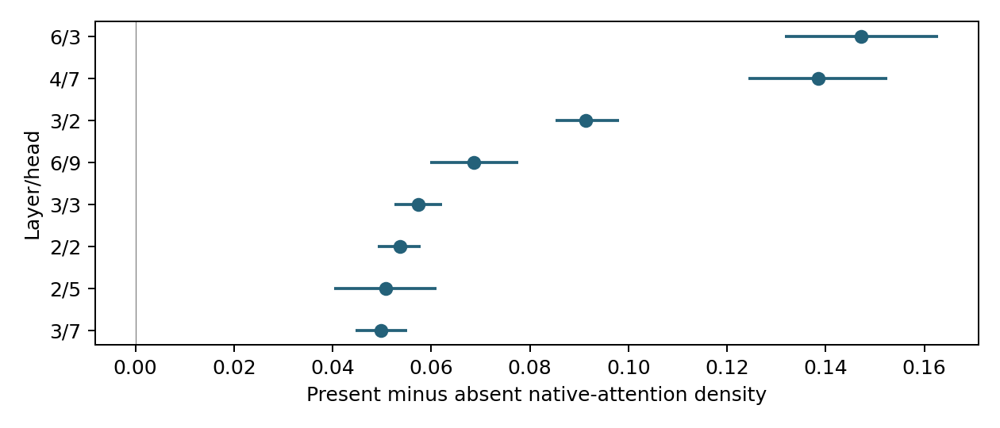
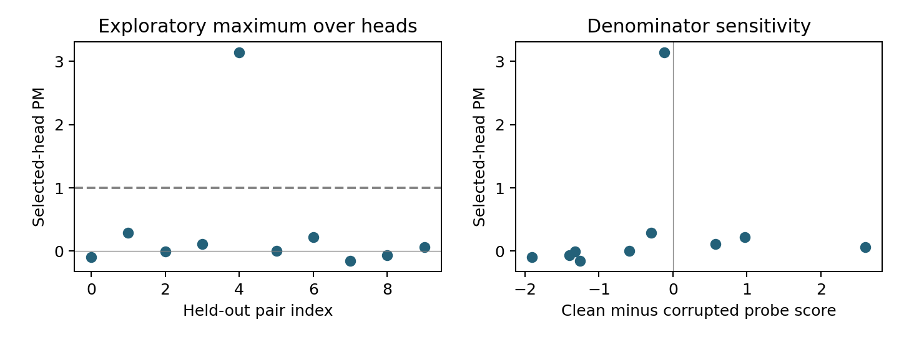

# MINTS

**Mechanistic Interpretability for Nucleotide Transformer Sequences**

MINTS is a reproducible mechanistic-interpretability pipeline for genomic transformers. It extracts DNABERT-2 QK/OV circuit matrices, probes frozen residual streams, aligns JASPAR CTCF motif scores to nucleotide tokens, measures attention associations under genomic controls, and runs activation patching on held-out sequence pairs.

MINTS asks a narrow question: what evidence is required before calling a genomic-transformer attention head a biological motif detector? The pipeline separates label decodability, motif-local association, and intervention effects on a specified output. These measurements support different claims, and the current results do not establish a native CTCF causal mechanism.

## Native masked-flank feasibility pilot

The paper is now titled **MINTS: Auditing Evidence for Motif Detection in Genomic Transformer Attention Heads**. Its main findings are the gap between decodability, attention association and causal use, broken historical patch alignment, unstable restoration ratios and a negative fitted CTCF incremental comparison. The latter does not prove absence of additional information, and individual-head screen failures leave distributed mechanisms unresolved.

A separate discovery-only pilot loads the pinned pretrained MLM head with no missing prediction weights and measures recovery of one unchanged masked flank token across composition-preserving CTCF edits and matched shams. Exact token spans and target IDs must agree, and the motif difference must remain visible after masking. No trained probe or prior trained-readout head is reused.

    python tools/run_native_endpoint.py --device cuda --output results/native_endpoint_new
    python tools/build_native_artifacts.py

The runner requires the pinned local model/tokenizer cache and prepared CTCF sequences, writes its full protocol before scoring, and refuses nonempty output directories. The artifact builder verifies the saved default `results/native_endpoint` run; a new exploratory run does not silently replace the manuscript evidence. The saved pilot retains 12 discovery sequences in 11 genomic clusters. Its motif-minus-sham loss is -0.0568 nats, with a 95% cluster interval of [-0.2513, 0.0869], so it stops before head selection or confirmation. This is an inconclusive feasibility result, not a precise mechanistic null.

The [literature and biological-source review](docs/native_endpoint_review.md) records overlap with the July 2026 dictionary-ablation preprint, requirements for a future frozen confirmation, and GSE81945's hg19/allele-data compatibility limits. The already inspected chromosomes 20/21 cannot provide fresh confirmation for this extension. Any revised endpoint starts a new exploratory study.

The research paper lives in [`paper/main.pdf`](paper/main.pdf), with source in [`paper/main.tex`](paper/main.tex).

## Hardened mechanistic assays

The current assay workflow is separate from the archived results below. It validates nucleotide correspondence before patching, preserves composition, contrasts motif edits with matched shams, selects heads on discovery chromosomes, and confirms them on independent chromosomes. Historical TATA PM rankings are diagnostic artifacts: six of ten archived pairs have incompatible nucleotide boundaries at patched positions.

Use Python 3.14. The Windows CUDA and fresh Windows CPU environments are locally verified. Linux installation configurations and CPU CI are provided; Linux execution has not been verified locally. TransformerLens and Triton are optional: scientific interventions use native HF hooks and the validated PyTorch attention fallback.

    python -m pip install -r requirements-cuda-windows.txt
    python -m pip check
    python tools/preflight.py --scientific
    python main.py hardened --device cuda
    python tools/build_hardened_artifacts.py
    python results/hardened/cohort_diagnostics/build_balance.py
    python tools/review_manuscript_artifacts.py

For CPU checks, install requirements-cpu.txt and run:

    python -m pytest -q -m "not artifact" --basetemp .test-tmp
    python -m pytest -q -m artifact --basetemp .test-tmp

The artifact suite validates saved scientific outputs; passing synthetic tests alone does not certify biological results. Fresh scientific execution needs the pinned tokenizer/model cache, prepared hg38/CTCF inputs, and downstream residual caches from the ingestion pipeline. Historical cache reuse records byte hashes and its provenance limits, rather than assigning checkpoint identity from hashes. The runner retrieves and MD5-verifies the small independent ENCODE DNase input ENCFF598KWZ.

Results go to [results/hardened](results/hardened), with stage commands, runtime versions, source hashes, exclusions and raw effects. Six stages cover diagnostics, known-mechanism calibration, incremental prediction, controlled patching, native genomic sensitivity, and accessible CTCF peak-overlap prediction/intervention. Use the stage option to run one stage. Completed stages refuse replacement unless the explicit replace-stage option is supplied; previous execution receipts are archived. Use a fresh output directory when changing the scientific protocol.

Default caps are 12 discovery sequences, 64 confirmation sequences with up to three eligible edits each, and 256 randomly selected pairs per genomic configuration. Motif scoring scans all 51,249 peaks. The independent CTCF cohort caps each class at 512 training, 128 validation and 128 test examples. These caps, candidate searches, seeds and eligibility exclusions are recorded in the protocol and manifests. The TATA study retained 16 confirmation sequences, and donor matched-edit eligibility was insufficient. For a two-base GT-to-TG swap, a width- and transition-matched non-motif sham necessarily creates a new GT hit, so this exclusion reflects control feasibility. Increasing caps cannot resolve that constraint; donor intervention requires a wider-context control design. Increase the explicit CLI caps for larger studies without silently pooling discovery and confirmation.

Prediction compares motif/position/composition baselines with baseline-plus-residual models on identical populations, tuning regularization on chromosomes 18/19 and evaluating on 20/21. Paired AUROC intervals use sequence and transitive genomic-block sampling. Patching reports absolute motif-minus-sham score effects, individual scores, leave-one-out estimates, six position schemes and reverse interventions. Native CTCF comparisons recompute PWM thresholds, token matching and alternate aggregation, with content-only and position-only controls and simultaneous inference over heads.

The added CTCF output is a trained frozen readout of peak overlap within independently measured accessible windows. It does not certify native pretrained binding causality, and non-overlap is not verified absence of binding. Oracle detector calibration measures power in engineered attention computations. Normalized CTCF BED-score balance and sequence-complexity diagnostics are reported in the descriptive cohort audit. Repeat annotations, quantitative CTCF occupancy, distant homology and cross-cell biological replication remain unavailable or outside the implemented inference scope.

Legacy pipeline resume now requires immutable upstream receipts with compatible model/tokenizer revision, settings, pooling, source and artifact hashes. Older outputs without these receipts cannot be resumed as verified new executions. The historical manuscript inserts remain in paper/results.tex; the new source-backed inserts are generated in paper/hardened_results.tex, with paper_manifest.json verifying their evidence.

## Historical workflow and results

## Key Achievements

- **One-command reproducibility:** `python main.py` runs the configured data, model, circuit, probe, control, motif-scoring, patching, and uncertainty analyses. Package versions, seeds, runtimes, failures, and artifact hashes make individual runs traceable.
- **Leakage checks:** Pinned dataset and model revisions, exact partition membership, chromosome and window checks, reverse-complement checks, and equal-length near-duplicate detection protect held-out evaluation.
- **Performance context before mechanism:** Frozen DNABERT-2 readouts are compared with composition and 3–6-mer classifiers, with sequence-bootstrap intervals. The k-mer classifier has higher point AUROC on both promoter tasks.
- **Sequence-level genomic controls:** Motif-present and motif-absent CTCF peaks are matched on chromosome, GC fraction, and length. Native attention and content-QK contrasts use matched-pair inference and separate Holm corrections across heads.
- **Held-out probe patching:** Test-only clean/corrupted pairs retain scalar scores, denominators, pair-level effects, medians, and intervals. Repeated clean sequences form one bootstrap cluster; probe restoration is not presented as native biological behavior.
- **Artifact-backed manuscript:** One generated [`paper/results.tex`](paper/results.tex) supplies numerical variables and table bodies, with source hashes linking displayed results to saved machine-readable artifacts.

## Overview

### What it does

MINTS prepares nucleotide benchmark data, loads DNABERT-2, exports model internals, trains residual-stream probes, scores biological motifs, creates motif-destroying counterfactuals, and writes reproducible outputs under [`results/`](results). A biological motif-detector claim requires aligned localization and causal evidence for the same motif on a validated native output.

### Why it matters

Genomic prediction accuracy can reflect distributed representations, sequence composition, or dataset shortcuts. Probes and attention maps help formulate hypotheses, but neither identifies a causal biological mechanism on its own. MINTS makes the output target, control population, token alignment, and uncertainty explicit before interpreting a component.

### What is novel here

The project combines curated biological motif hypotheses with circuit measurements and interventions in one auditable workflow. Its contribution is an evidence standard demonstrated through a genomic-transformer case study, including negative screens and the limits of probe-based interventions.

### Biology and tokenization primer


MINTS uses biological motifs as concrete mechanistic hypotheses. CTCF is the strict test case because it has a curated JASPAR binding motif and public ENCODE GM12878 peak calls. TATA boxes and splice donor sites are used for auxiliary perturbation tests because their sequence edits are compact and task-relevant.

| Term | Meaning |
|---|---|
| Motif | Recurring DNA pattern associated with a biological function |
| PWM | Position weight matrix for scoring motif-like DNA windows |
| JASPAR | Public motif database; this project uses CTCF matrix `MA0139.1` |
| CTCF | DNA-binding protein involved in chromatin organization and regulatory insulation |
| TATA box | A/T-rich promoter element used for promoter perturbation tests |
| Promoter | Regulatory DNA region near a gene start site |
| Splice donor/acceptor | Intron boundary signals, usually `GT` and `AG` in genomic DNA |
| Nucleotide token | Model input unit covering one or more DNA characters |
| k-mer | Fixed-length DNA substring, such as a 6-mer |
| BPE | Learned variable-length tokenizer; DNABERT-2 BPE tokens can span different nucleotide counts |

Token support is interval-based. A motif hit spans a half-open nucleotide interval `[a, b)`, and a model token spans `[u, v)`. The token supports the motif when `max(0, min(v, b) - max(u, a)) >= 1`, meaning at least one nucleotide base overlaps. Special tokens with zero-width offsets stay aligned to hidden states but do not receive motif support.

### How it works

1. Read [`src/config.py`](src/config.py), pin upstream revisions, and prepare output directories.
2. Download and tokenize downstream tasks, recording labels, coordinates, exact membership, and sequence hashes.
3. Check train/test chromosome separation, overlapping windows, exact and reverse-complement duplicates, and equal-length pairs within two substitutions.
4. Download ENCODE GM12878 CTCF BED peaks and the hg38 reference, then extract peak sequences.
5. Load DNABERT-2 on the configured device and capture residual streams and attention-head contexts through compatible forward hooks.
6. Cache residual vectors, export QK/OV matrices, and fit frozen readouts alongside sequence baselines.
7. Run composition, position, random-label, and distribution-shift probe controls.
8. Align JASPAR CTCF PWM scores to BPE token spans and export the historical motif-local QK and enrichment screens.
9. Generate test-only motif edits and patch individual head contexts, saving clean, corrupted, and patched probe scores.
10. Sweep descriptive screening thresholds and run matched genomic controls using validated native attention and sequence-level content QK.
11. Compute sequence or sequence-pair uncertainty, correct head-level searches, and generate manuscript tables and figures from saved artifacts.

## Main Results

### DNABERT-2 Residual Probes

The frozen readout is a standardized, balanced logistic classifier over mean-pooled layer-11 representations. It is reported once; it is not encoder fine-tuning. GC and k-mer classifiers use sequence-derived features alone.

| Task | GC AUROC [95% CI] | 3–6-mer AUROC [95% CI] | Frozen readout AUROC [95% CI] |
|---|---:|---:|---:|
| TATA promoter | 0.8955 [0.8496, 0.9337] | 0.9297 [0.8947, 0.9598] | 0.9136 [0.8748, 0.9476] |
| Other promoter | 0.9088 [0.8937, 0.9236] | 0.9406 [0.9292, 0.9517] | 0.9383 [0.9253, 0.9499] |
| Splice donor | 0.6560 [0.6375, 0.6750] | 0.8185 [0.8046, 0.8320] | 0.8954 [0.8838, 0.9059] |
| Splice acceptor | 0.6361 [0.6156, 0.6547] | 0.7956 [0.7792, 0.8113] | 0.8847 [0.8724, 0.8959] |

The labels are decodable from frozen representations. K-mer classifiers have higher point AUROC on both promoter tasks, while DNABERT-2 readouts have higher point AUROC on the splice tasks. These point comparisons do not establish statistical superiority or identify a causal motif feature. Intervals resample test sequences conditional on fixed trained classifiers; they exclude training and checkpoint variability.

Source: [`classification_metrics.csv`](results/review/classification_metrics.csv) and the corresponding saved per-sequence predictions.

### Probe Interpretation Controls

GC matching uses a 0.02 fraction caliper without replacement and reports the retained population. Unconstrained matching of a balanced test set can merely reorder its examples, so identical full and matched AUROC is not evidence that composition has been controlled.

| Task | Full test examples | GC-matched examples | Matched readout AUROC [95% CI] |
|---|---:|---:|---:|
| TATA promoter | 212 | 82 | 0.7787 [0.6663, 0.8681] |
| Other promoter | 1,372 | 456 | 0.7254 [0.6796, 0.7710] |
| Splice donor | 3,000 | 2,256 | 0.8600 [0.8448, 0.8751] |
| Splice acceptor | 3,000 | 2,352 | 0.8607 [0.8457, 0.8750] |

Promoter readout AUROC is lower on the retained populations, and the GC baseline approaches chance. Because matching selects a different population, the AUROC change does not isolate a GC effect. Coordinate, random-label, and GC-shift controls provide additional checks without certifying a biological mechanism.

### CTCF QK and Attention Enrichment

The historical scan covers 51,249 CTCF peak sequences. It distinguishes 256,918 unique motif-support tokens from 281,915 token occurrences summed separately across overlapping motif hits. No head passed the historical motif-local QK and attention-enrichment screens. Their weight-only reconstruction and token-weighted aggregation limit interpretation; screen failure does not establish that no detector exists.

The separate native-attention assay retains 5,220 matched motif-present/absent peak pairs. It finds positive density contrasts in 58 heads after Holm correction. Sequence-level content-QK correlations and matched contrasts are reported separately. These are conditional genomic associations, not native CTCF causal effects; PWM-absent peaks remain binding-assay peaks rather than unbound controls.

Sources: [`ctcf_native_control_inference.csv`](results/review/ctcf_native_control_inference.csv), [`ctcf_sequence_qk_inference.csv`](results/review/ctcf_sequence_qk_inference.csv), and the [assay manifest](results/review/ctcf_native_controls_manifest.json).



### Activation Patching

The archived held-out TATA experiment retains 10 shape-compatible test pairs, six with incompatible nucleotide boundaries at patched positions; its PM ranking is withdrawn as aligned intervention evidence. The head with the largest observed mean PM is layer 2, head 7: mean 0.3611, median 0.0306, and marginal mean interval [-0.0265, 1.0250]. Head selection is exploratory, and this interval includes zero.

The scalar target is a trained probe's decision function. Sign-changing clean-corrupted differences and PM overshoot limit interpretation of mean restoration; interventions also change composition and can combine off-manifold activations. These effects do not establish native motif detection.

Sources: [pair-level summary](results/review/heldout_patching_summary.json) and [raw held-out patching effects](results/cross_model/review_tata_heldout/patching/promoter_tata_batch_dnabert_activation_patching_pair_effects.npz).



## Running

Create an environment and install dependencies:

```powershell
python -m venv .venv
.\.venv\Scripts\Activate.ps1
python -m pip install -r requirements.txt
```

For the recorded CUDA environment, use Python 3.14 and install the [exact package versions](results/review/clean_requirements.txt):

```powershell
python -m pip install -r results/review/clean_requirements.txt --extra-index-url https://download.pytorch.org/whl/cu126
```

Run the full configured pipeline:

```powershell
python main.py
```

For isolated outputs, specify a new run directory. The runner refuses to overwrite a completed run and records environment details and artifact hashes:

```powershell
python tools/review_full_pipeline.py --run-directory results/review/full_run
```

Useful flags:

- `--device`: choose `auto`, `cuda`, a specific CUDA device, or `cpu`.
- `--max-probe-train` and `--max-probe-test`: cap activation caching and probing for exploratory runs.
- `--max-qk-alignment-sequences` and `--max-patching-pairs`: cap historical QK scans and patching; caps do not apply to every pipeline stage.
- `--only-probe-controls`, `--only-task-performance`, and `--only-threshold-sensitivity`: rerun the named analysis from its required saved inputs.
- `--probe-bootstrap-samples` and `--probe-ci-level`: configure cached-residual probe intervals; the manuscript artifact analyses use their recorded fixed settings.
- `--from-step`: resume at a named stage and continue forward.
- `--overwrite`: replace generated input datasets and downloaded artifacts.
- `--json`: print a machine-readable completion payload.

Resume an interrupted run:

```powershell
python main.py --from-step systematic_causal_intervention
python tools/review_full_pipeline.py --run-directory results/review/full_run --from-step strict_mechanistic_proofs
```

Regenerate individual artifact analyses after their inputs exist:

```powershell
python tools/review_audit.py
python tools/review_tables.py
python tools/review_patching.py
python tools/review_ctcf_controls.py
python -m pytest -q
```

The audit and classifier refits reuse datasets and activation caches; patching and genomic controls run model inference. The default workflow excludes unvalidated cross-model comparisons and experimental sparse-feature searches retained in the source tree.

### Build the paper

```powershell
python tools/review_manuscript_artifacts.py
latexmk -pdf -cd -interaction=nonstopmode -halt-on-error -outdir=review-build paper/main.tex
Copy-Item -LiteralPath paper/review-build/main.pdf -Destination paper/main.pdf
```

The generator uses saved CSV/JSON/NPZ inputs and writes numerical variables and table bodies into [`paper/results.tex`](paper/results.tex). Use `--input-run-directory PATH` to import completed isolated-run outputs before generation. Use `python tools/review_patching.py --summarize-run PATH` to recompute exact-input cluster intervals from saved pair effects without rerunning the model.

## Data

The pipeline obtains downstream tasks from [`InstaDeepAI/nucleotide_transformer_downstream_tasks_revised`](https://huggingface.co/datasets/InstaDeepAI/nucleotide_transformer_downstream_tasks_revised). Tasks are `promoter_tata`, `promoter_no_tata`, `splice_sites_donors`, and `splice_sites_acceptors`. Saved data have chromosome-separated train/test partitions and no independent validation partition.

CTCF inputs use ENCODE experiment `ENCSR000DKV`, BED peak file `ENCFF827JRI`, the UCSC hg38 reference, and JASPAR matrix [`MA0139.1`](https://jaspar.elixir.no/matrix/MA0139.1/). The configured URL list is [`data/ENCODE4_v1.5.1_GRCh38.txt`](data/ENCODE4_v1.5.1_GRCh38.txt); only BED peak files are downloaded from that list.

Generated inputs live in `data/hf_downstream/`, `data/encode/`, `data/genomes/`, and `data/ctcf/`. Dataset construction, licenses, alignment definitions, and limitations are described in the paper. Membership checks do not independently reconstruct upstream biological labels or rule out reference-genome overlap during pretraining.

## Outputs

- [`results/pipeline_run.json`](results/pipeline_run.json): pipeline stages, runtimes, and completion or failure details.
- [`results/review/classification_metrics.csv`](results/review/classification_metrics.csv): sequence-baseline and frozen-readout metrics with uncertainty.
- [`results/review/correctness_audit.json`](results/review/correctness_audit.json): partition checks, motif-count stages, and artifact provenance.
- [`results/review/ctcf_native_control_inference.csv`](results/review/ctcf_native_control_inference.csv): matched native-attention contrasts and corrected tests.
- [`results/review/ctcf_sequence_qk_inference.csv`](results/review/ctcf_sequence_qk_inference.csv): sequence-level QK correlations and matched contrasts.
- [`results/review/heldout_patching_summary.json`](results/review/heldout_patching_summary.json): held-out probe effects and denominator diagnostics.
- [`results/review/tables_manifest.json`](results/review/tables_manifest.json): manuscript table and figure sources and hashes.
- [`results/review/clean_reproduction.json`](results/review/clean_reproduction.json): completed scientific stages and reproducibility limits.
- [`results/review/completion_validation.json`](results/review/completion_validation.json): test/build results, artifact checks, and author verification.

Large datasets, weights, activation caches, QK/OV archives, and token-score dumps are generated locally and ignored by Git. Small summaries, selected pair-level evidence, manifests, and figures accompany the code. Recorded runs preserve failures and resumptions rather than treating partial execution as completion.

## Repository Layout

- [`main.py`](main.py): CLI entry point.
- [`src/config.py`](src/config.py): pinned inputs, model defaults, task names, paths, and analysis settings.
- [`src/reproduce.py`](src/reproduce.py): pipeline orchestration and execution manifests.
- [`src/data_ingestion.py`](src/data_ingestion.py) and [`src/integrity.py`](src/integrity.py): task construction, membership records, and leakage checks.
- [`src/modeling.py`](src/modeling.py), [`src/activations.py`](src/activations.py), and [`src/circuits.py`](src/circuits.py): model hooks, residual caches, and circuit extraction.
- [`src/motif_scoring.py`](src/motif_scoring.py) and [`src/qk_alignment.py`](src/qk_alignment.py): PWM alignment and QK/attention measurements.
- [`src/probing.py`](src/probing.py) and [`src/inference.py`](src/inference.py): frozen probes, controls, uncertainty, and multiplicity correction.
- [`src/counterfactuals.py`](src/counterfactuals.py) and [`src/patching.py`](src/patching.py): clean/corrupted pairs and head-context interventions.
- [`tools/`](tools): isolated execution, artifact audits, genomic controls, statistics, and manuscript generation.
- [`tests/`](tests): pipeline, leakage, metric-range, raw-result, and artifact-consistency tests.
- [`paper/`](paper): manuscript, generated numerical input, references, and compiled PDF.

Original MINTS code is [MIT licensed](LICENSE). Third-party datasets, models, and venue style files retain their own terms.

## Native endpoint follow-up

The [follow-up diagnostics](docs/native_followup.md) record geometry feasibility, independent masked-token recovery, native intervention controls, eligibility and cluster influence, and the recovered measured allele table. Hash-verified evidence lives in `results/native_followup/`. Tight within-sequence geometry matching is structurally infeasible for the original 19-base edits; the failed sensitivity gate remains in force.
